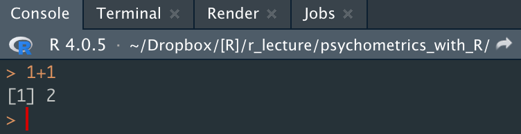
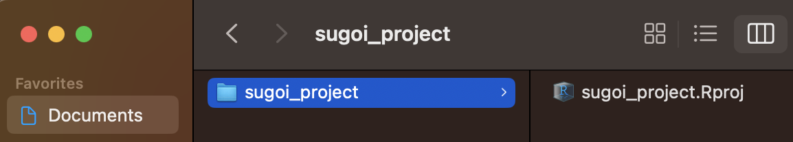

# Go!! 

- とりあえずまずは使ってみよう！

## RStudioを開く

- RStudioのアイコンから起動
- 次のような、４つの枠（ペーン）に分かれた画面が表示される  

  
  
  　　**①左上：**メインの作業場でコードを書くところ  
  　　**②右上：**変数やオブジェクトのリストが表示されたり、バージョン管理を行う  
  　　**③左下：**コードの実行結果が表示されるコンソールや、各種コマンドを実行するターミナルなど  
  　　**④右下：**各種ファイルやパッケージの表示、出力した図の表示など  
  　　

## コンソールに直接打ち込む

- RStudioの左下のペーンを見る  
- Consoleのタブが選択されていることを確認
- 最下段の`>`のあとに`1+1`と打ち込み**Enter（macはreturn）**を押す
- `[1] 2`と返ってくる
- `2`の部分が`1+1`の計算結果

## Rスクリプトを使う

- コンソールに書いたコードは、Rstudioを終了すると消える  
（実際に終了して再起動してみよう）  
- だから、保存可能な**Rスクリプト**にコードを書くことが多い

##### Rスクリプトに書く：{-}
- RStudioの左上の  
をクリックし、「R Script」を選択
- 空のRスクリプトファイルが作成され、左上のペーンに表示される
- 1行目に`1+1`と入力して**ctrl+Enter（macはcommand+return）**を押す  
 （  をクリックしても良い）
- 左下のペーンのコンソールに結果(`[1] 2`)が表示される

##### 保存：{-}

- Rスクリプトは**ctrl+s（macはcommand+s）**で好きな時に保存できる
- 初回はファイル名と保存場所も決める
- 試しに、保存したRスクリプトのタブを閉じてみよう
（タブの右側の×をクリック）
- 左上の  をクリックし、保存したRスクリプトのファイルを選択  
- Rスクリプトが先ほど保存した状態で開く 
  
##### さらに書く！：{-}  

- 2行目に`5-2`と入力する
- 2行目にカーソルを合わせて**ctrl+Enter**を押す
- 2行目の計算結果(`[1] 3`)が表示される
- 1行目にカーソルを合わせて**ctrl+Enter**を押す
- 1行目の計算結果(`[1] 2`)が表示される
- つまり、実行したい行にカーソルを合わせて**ctrl+Enter**を押せば良い
- 全ての行を一括で実行したいなら**ctrl+shift+Enter（macはcommand+shift+return）**
- 一部分だけ実行したいなら、下図のように実行したい行だけ選択して**ctrl+Enter**  
  

  
  
##### Rスクリプトを使うメリット：{-}
1. コードが保存できる（毎回書き直さなくて良い！）
1. 長く複雑なコードを書いたり、管理するのが楽  
1. 他の人に配布できる（分析を再現してもらいやすい）  
などなど...

## プロジェクト管理  
  
- 研究プロジェクトが進むと、ひとつのRスクリプトだけでは管理しきれなくなる
- **プロジェクト**を使えば、複数のRスクリプトや関連データなどを一つのフォルダにまとめて効率よく管理できる

##### プロジェクトの作成： {-}

- 左上の  をクリックし、「New Directry」→「New Project」の順に選択  
- 次の画面で<u>①プロジェクト名</u>と、その<u>②作成場所</u>を指定して<u>③「Create Project」</u>  
  

  

- 指定した場所に、指定したプロジェクト名のフォルダができているのを確認しよう
- そのフォルダの中に「プロジェクト名.Rproj」というファイルができているのを確認しよう
- 以下は、macでDocumentフォルダ内にsugoi_projectというプロジェクトを作った例  
  

  
  
- 初めはご利益がわかりにくいが、研究プロジェクトごとにプロジェクトを作るクセをつけよう
- そして、次の心得に従い、プロジェクト上で作業をするようにしよう！

1. 毎回「プロジェクト名.Rproj」をダブルクリックしてRstudioを起動
1. 関連するファイルはプロジェクト名のフォルダにまとめて一元管理

