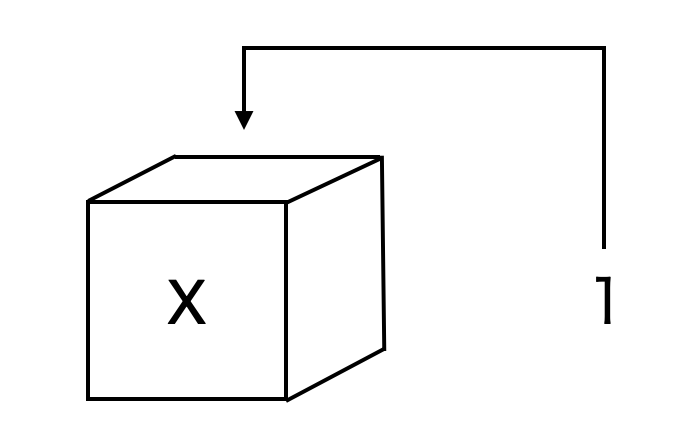

# 基本操作

- 本章の説明がわからない人は、森知晴先生のすばらしい動画たちを参考にしよう！

1. [オブジェクトの使い方 in R](https://youtu.be/CblsIBlzqX0)  
1. [関数の使い方 in R](https://youtu.be/q8MI6P2hoUM)  

## 四則演算

**たし算:** `+`を使う  
```{r}
1 + 1
```

**ひき算:** `-`を使う  
```{r}
5 - 2
```

**かけ算:**  `*`を使う  
```{r}
4 * 5
```

**わり算:** `/`を使う（分数のイメージ）
```{r}
8 / 2
```

**累乗:** `^`か`**`を使う（例：$4^2$なら次のとおり）
```{r}
4 ^ 2
4 ** 2
```

---

## 変数とオブジェクト

- オブジェクトとは、色々なモノを入れる箱のようなもの[^1]  
- オブジェクトを変数という人もいる（数学の変数のようなイメージだから）
- 本資料では変数と呼ぶことにする（字数が少ないから）

- 次のコードを見てみよう

```{r}
x <- 1 # <- は左向矢印のイメージ

# このように#から始まる文章を書いてコメントを残せる
# これをコメントアウトと呼ぶ
# あとで見てわかりやすいような覚え書きなどを残そう
```

<div align="center">

</div>  
  
- これはxという箱を作り、その中に数字の1を入れたイメージ  
（変数xに１を代入したイメージでもOK！）
- 上のコードを実行しても何も表示されないが、それでOK  
（「箱に入れる」だけのコードなので表示はされない）
- 変数の中身を確認したい時は、オブジェクトの名前を書いて実行

```{r}
x
```

- 数値を代入した変数同士で演算もできる

```{r}
y <- 1 
z <- 2
y * z # 1*2を計算したことになる
```

- 変数はいつでも上書きできる

```{r}

x <- 1 #xに1を代入
x

x <- 2 #xを2に上書き
x
```

- 計算結果を変数に代入することもできる

```{r}
x <- 2+5 
x # 計算結果の7が代入される
```

- 慣れるまでは不思議だが、こんなこともできる
- 意外とよく使うので、頭の片隅に留めておこう

```{r}
z <- 2 #zに2を代入
z <- z + 1 #z=2に1を足したものを、もう一度zに代入
z #新しいzを表示
```

- 変数には数値以外も入れることができる
- 例えば、mojiという変数を作り文字列を入れてみる

```{r}
# 文字列は"ダブルコーテーション"で囲む
# 'シングルコーテーション'でも良い
# 次のようにアルファベット以外も一応使えるが推奨しない

moji <- "岡田先生ステキ"
moji
```

練習問題 {-} 
- 変数xに3、変数yに6を代入する
- xとyをそれぞれ2乗して和をとり、結果が45となることを確認する

---

## 関数①（数値に対する関数）

#### 関数のキホン：{-}

- Rにはさまざまな機能を実行できる関数が用意されている
- 例えば、平方根を計算する関数が`sqrt()`
- `()`の中に数値を入れると、その平方根を返してくれる

```{r}
sqrt(2)
```

- このように関数は`xxx()`のように最後が丸括弧になっている
- 丸括弧の中に、引数(ひきすう)と呼ばれる指定された形式の値を入れて実行する
- その結果、出力された値を戻り値という
- 先ほどの`sqrt(2)`なら`2`が引数で、計算結果の`1.414214`が戻り値  

#### 複数の引数を持つ関数：{-}  
  
- 引数は１つとは限らないので注意
- 例えば、`log()`は対数を計算する関数
- 次のようにすると、10の自然対数を返してくれる

```{r}
log(10)
```

- でも、2つ目の引数`base=10`を付け足すと、底が10の常用対数を返してくれる

```{r}
log(10, base = 10)
```
  
- 他にも、数え切れないほどの関数がある
  
#### 関数の機能や引数の調べ方：{-} 

- 関数の機能や、どんな形式の引数をいくつ持つかを調べるには`help()`を使う
- 知りたい関数から`()`を除いたものを、`help()`の中に入れる
- 例えば、`log()`について知りたいなら`help(log)`と書いて実行
- すると、Rstudioの右下（左下ではない！）のペーンに詳細が表示される

---

## ベクトルと行列

- Rでは、複数のデータの値をひとまとめにして扱いやすくできる

### ベクトル

- データを1列に並べたものをベクトルと呼ぶ
- ベクトルは関数`c()`を使って作る
- ベクトルも変数に入れることができる
- 例として、5つの数字（例えば、2,4,2,3,5）を並べたベクトルを変数`v`に代入する

```{r}
v <- c(2, 4, 2, 3, 5) #ベクトルを作り変数に代入
v #変数vの中身を確認
```

- 連番のベクトル（例えば2,3,4,5,6）を作りたい時は、次のようにも書ける

```{r}
v <- c(2:6) #「n:m」で「nからmまで」の意味
v
```


#### ベクトルと数値の演算： {-} 

- ベクトルにも四則演算の記号（=演算子）を使った演算ができる
- ベクトル内のそれぞれの数字に、四則演算が施される
- 以下の出力結果で確認してみよう

```{r}
  
v+2  #それぞれの数字に２を足す 
2*v  #それぞれの数字に２をかける  

```

##### 練習問題 {-} 
- 上の`v`について、`v-2`、`v/2`、`v^2`の実行結果を確認する

#### ベクトル同士の演算： {-} 

- Rでは、ベクトル同士の演算もできる
- まずは2つのベクトルを用意しよう

```{r}
v1 <- c(1, 2) 
v2 <- c(2, 4) 
```

- これらを`+`を使って「足す」
- すると、１つめの数同士（1と2）と、２つめの数同士(2と4)が足される

```{r}
v1 + v2
```

- `*`を使って「かける」場合も、同じように1つめの数同士、2つめの数同士がかけられる

```{r}
v1 * v2
```

- ベクトル同士の「かけ算」には内積がある
- Rでは、`%*%`で内積を計算できる

```{r}
v1 %*% v2 
```

- ベクトルの長さ（=入っている数値の個数）が違うとおかしな計算になり、警告が出る

```{r}
#以下のv1には3つの要素があるけど、v2には2つしかない
#この場合、v2の1つめの要素を無理やりv1の３つめに足してしまう

v1 <- c(1, 2, 3)  #3つの数を代入
v2 <- c(2, 4) #2つの数を代入
v1 + v2 #長さが違うからうまく計算できず警告が出る
```

##### 練習問題 {-} 
- 上の`v1`と`v2`を使い、`-`、`/`、`^`の３つの演算を行う
- いずれも1つめの数値同士、2つめの数値同士で対応した演算がなされることを確かめる

#### 要素の抽出：{-} 

- ベクトルから、任意の要素（`n`番目の数）を抽出する方法を説明する
- `x`という名前のベクトルからn番目の要素を抽出する時は`x[n]`
- 具体例として、先ほどのベクトル`v=c(2,4,2,3,5)`で考える
- 2番目の要素（つまり4）を抜き出したいなら、`v[2]`と書く

```{r}
v[2]
```

- 2〜４番めの要素(つまり4,2,3)を抜き出したいなら、`v[2:4]`と書く

```{r}
v[2:4]
```


### 行列

#### 行列のキホン：{-}

- データを行と列の2次元に並べたものを行列と呼ぶ
- 例えば、2行3列の行列
$\begin{pmatrix}
1 & 2 & 3 \\
4 & 5 & 6 \\
\end{pmatrix}$
を作ってMに代入するには、`matrix()`を使い次のように書く

```{r}
#初めの1:6はc(1:6)と同じで「1,2,3,4,5,6」の意味
#この6つの数字を、2つの行(row)と3つの列(col)に分ける
#byrow = Tで、6つの数字を左から右（zの書き順）に埋めるよう指示
#byrow = Tを消すと、上から下に埋める（各自確かめよう）

M <- matrix(1:6, nrow = 2, ncol = 3, byrow = T)
M
```

- 次の関数を使って、ベクトル同士を結合しても行列を作れる

```{r}
v1 <- c(1,2,3) 
v2 <- c(1,1,1) #2つのベクトルv1とv2を作る

rbind(v1, v2) #v1とv2を行(row)方向に繋げる
cbind(v1, v2) #v1とv2を列(column)方向に繋げる

rbind(M, v1) #「行列とベクトル」や「行列同士」も繋げられる
```

#### 要素の抽出：{-}

- 行列`x`から要素を抜き出すには、` x[抜き出したい行、抜き出したい列]`と書く
- 具体例として、先の行列`M`から色々な要素を抜き出してみよう

```{r}
# 2行1列目を抽出し、変数M21に代入
M21 <- M[2,1]

# 2行めを抽出
M[2,]

# 1列めを抽出
M[,1]

# 1,2行めと1,3列めを抽出
M[c(1,2),c(1,3)]

```

#### 行列の演算：{-}
- n行n列の２つの行列同士の計算について、足し算は`+`、引き算は`-`を使えば良い
- 以下の例のように、かけ算は`%*%`を使わなくてはいけないので注意

```{r}

M #先ほど作った2行3列の行列を表示
 
M2 <- matrix(c(1,2,0,1,0,2), nrow = 3, ncol = 2, byrow = T) #新たに3行2列の行列を作る
M2 #今作った2行3列の行列を表示

#２つの行列の積MN
M %*% M2 

#２つの行列の積MN
M2 %*% M　

v <- c(1,2,3) #要素が３つのベクトルを作る

#行列とベクトルのかけ算も%*%を使う
#縦ベクトルと横ベクトルは区別されないので、次のコードで計算できる
v %*% M2 # ただし、M2%*%vのように計算できない場合はエラーが出る（各自確かめよう）


```

---

## 関数②（ベクトルや行列に対する関数）

- 先の`rbind()`や`cbind()`はベクトルや行列も引数にとれる関数だった
- ベクトルや行列に対して使える他の関数をいくつか紹介する

#### ベクトルの頻出関数：{-}

- 以下の関数はどれもよく使うので、しっかり覚えよう

|関数(引数xはベクトル)|意味|
|:----|:----|
|summary(x)|基本統計量の一括表示|
|max(x)|xの要素の最大値|
|min(x)|xの要素の最小値|
|mean(x)|xの平均値|
|median(x)|xの中央値|
|var(x)|xの不偏分散|
|sd(x)|xの不偏標準偏差|
|sum(x)|xの各要素の総和|
|range(x)|xのデータの範囲（最小値と最大値）|
|length(x)|xのデータの個数（ベクトルの次元）|
|sort(x)|xの各要素を小さい順に並び替え|
|sort(x, decreasing = TRUE)|xの各要素を大きい順に並び替え|  

  
- 具体的に理解するため、5人の年齢のデータを作成する

```{r}
age <- c(36, 16, 43, 18, 22) #5人の年齢のベクトルを作成
```

- このベクトル`age`を引数にして、上表のいくつかを実行してみる

```{r}

summary(age) #基本統計量を一括表示

max(age) #一番大きい値を取り出す（5人のうち最年長は43歳）

mean(age) #算術平均（5人の平均年齢は27歳）

var(age) #不偏分散（5人の平均の分散は141）

length(age) #データの長さ（ベクトルの次元）（5個のデータなので5）

```

##### 練習問題 {-} 
- 引数を`age`にして、`min()`, `median()`,`sd()`,`sum()`,`range()`,`sort()`を実行する
- 各々の結果が何を意味しているのかを解釈する
- 引数を行列`M`にして、上表の各関数の結果を確認する

#### 行列の頻出関数： {-}

- 行列を引数に持つ関数のうち、比較的よく使うものをまとめる
- どのような結果になるかは各自確かめてみよう

|関数(引数xは行列)|意味|
|:----|:----|
|matrix(0, nrow=2, ncol=3) |2 行 3 列のゼロ行列を作成|
|diag(5)|5×5の単位行列作成|
|diag(X) <- 1|行列 X の対角成分を全て 1 にする|
|t(X)|行列 X の転置行列|
|solve(X)|行列 X の逆行列|
|det(X)|行列 X の行列式|
|rowSums(X)|行列 X の行和|
|colSums(X)|行列 X の列和|
|RowMeans(X)|行列 X の行平均|
|colMeand(X)|行列 X の列平均|

##### 練習問題 {-} 
- 上の各関数を先の行列`M`に使い、結果を確かめよう

---

## 演習問題 

- aさんの身長は149cm, bさんは153cm, cさんは169cm, dさんは174cmとする 
- aさんの体重は36kg, bさんは48kg, cさんは61kg, dさんは65kgとする  
<br>
1. 4人の身長を表した数値のみからなるベクトル（単位は不要）を作り、変数hに保存する  
1. 変数hの平均と標準偏差を求める  
1. ベクトルのかけ算を使い、４人の身長をインチで表すといくらになるか求める  
 （1cm＝0.39インチで計算し、結果は変数に保存しない）  
1. 4人の体重を表した数値のみからなるベクトル（単位は不要）を作り、変数wに保存する 
1. 変数hと変数wを結合して、１行目が身長、２行目が体重となる2×4行列を作り、変数Mに保存  
1. 行列の要素抽出を使い、変数Mからbさんの体重のデータを抜き出す 
1. 変数wを小さい順に並べ替えることで、身長の低い順に並び替えた変数h2を作る

```{r eval = FALSE, include = FALSE}
h <- c(149, 153, 169, 174)

mean(h)
sd(h)

0.39 * h

w <- c(36, 48, 61, 65)

M <- rbind(h,w)
M

M[2,2]

h2 <- sort(w)
h2


```


[^1]: 厳密にはRで出てくるあらゆるモノはオブジェクトだが、ここでは深く踏みこまない
